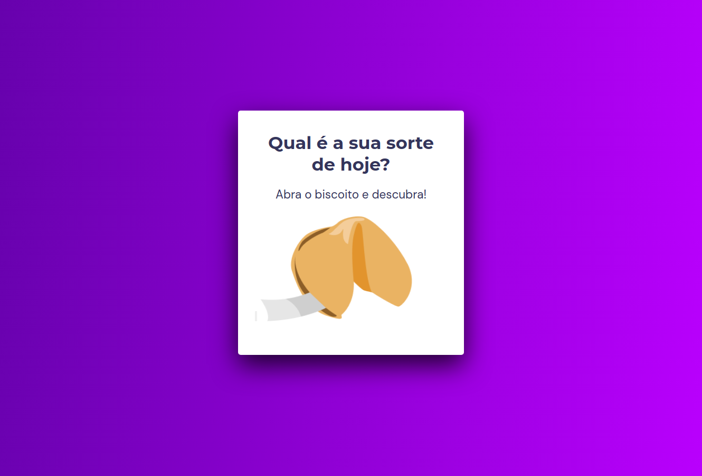

#  B i s c o i t o ~  d a ~ S o r t e

.png)

> Stage 5 - Avançando no JavaScript.

"Biscoito da Sorte" , projeto de um biscoito, ao clicar ele retorna a sua sorte.

 [Clique aqui para acessar]()

## ⌨️ Tecnologias

- HTML
- CSS
- JavaScript

## Conceitos aplicados no projeto:

- Estrutura de dados HTML
- Animações com CSS
- Funções no Javascript
- Manipulação da DOM
- Biblioteca JS Math()
- Funções *callback*
- Arrays

##  ❤️ Contato
- paula.tcelso@gmail.com